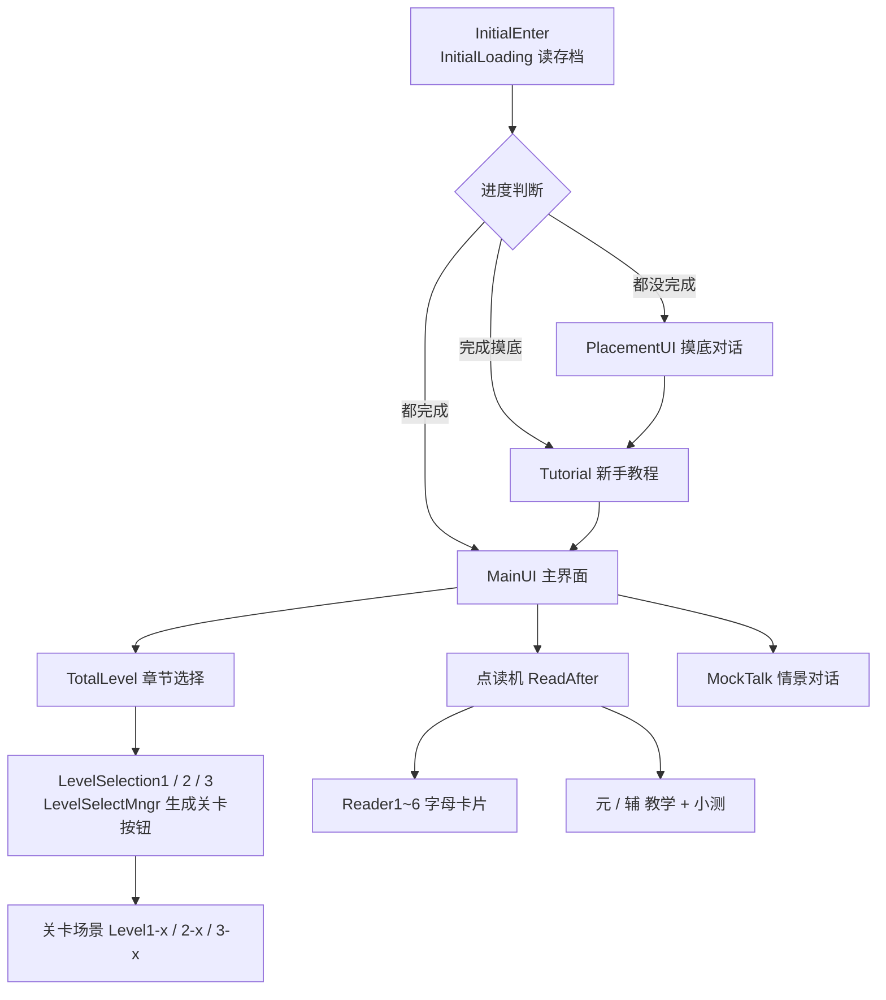
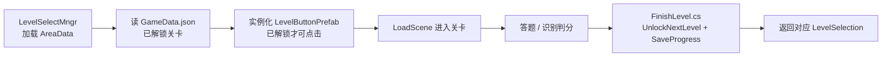

# 架构与场景流程

本文记录韩易成的运行时结构：场景如何串联、三大题型如何组织、进度如何存档，以及 AR 交互和 XR 配置的实现方式。

## 目录

- [启动分流](#启动分流)
- [功能模块](#功能模块)
- [关卡系统](#关卡系统)
- [进度与存档](#进度与存档)
- [AR 交互实现](#ar-交互实现)
- [XR 配置](#xr-配置)
- [开发约定与编辑器工具](#开发约定与编辑器工具)

## 启动分流

分流逻辑在 `Assets/AQY/Scripts/进入场景/InitialLoading.cs`：根据 `GameData.json` 中 `placementClear` / `tutorialClear` 两个字段决定进入摸底、教程还是主界面。

`EditorBuildSettings` 中共有 **47 个启用场景**，首场景为 `InitialEnter`。以下场景仅供开发调试，未加入构建列表：

- `Assets/AQY/Scenes/StartScene.unity`、`Assets/AQY/Scenes/213132.unity`
- `Assets/AQY/TestScenes/UIScene_1_Btn.unity`
- `Assets/AZ/RecFont/RecFontModel.unity`（手写识别单点调试场景）

## 功能模块

| 模块 | 入口场景 | 主要脚本 | 说明 |
| --- | --- | --- | --- |
| 启动分流 | `InitialEnter` | `Assets/AQY/Scripts/进入场景/InitialLoading.cs` | 读存档决定后续流程 |
| 摸底对话 | `PlacementUI` | `Assets/AQY/Scripts/摸底/PlacementMgr.cs`、`Assets/AQY/Scripts/对话/TextDisplay.cs` | 对话式询问学习目的与时长，结束写入 `placementClear = true` |
| 新手教程 | `Tutorial` | `Assets/AZ/Scripts/Tutorial/TutorialMgr.cs` | 多步 `CanvasGroup` 淡入淡出 + 分步配音，结束写入 `tutorialClear = true` |
| 主界面 | `MainUI` | `Assets/AZ/Scripts/MainUI/MainUIManager.cs`、`Assets/AQY/Scripts/个人资料/PersonalCard.cs` | 当前关卡、连续学习天数、头像昵称、音量与亮度设置 |
| 章节选择 | `TotalLevel` | `Assets/AQY/Scripts/选择章节/TotalLevelSelection.cs` | 进入第一章 / 第二章 / 第三章 |
| 选关 | `LevelSelection1/2/3` | `Assets/AZ/LevelSection/LevelSelectMngr.cs` | 按 `AreaData` 动态生成关卡按钮，管理解锁与存档 |
| 点读机 | `ReadAfter` → `Reader1~6`、`元`、`辅` | `Assets/AQY/Scripts/点读机/UIPrefabGenerator.cs` | 卡片式字母教学：图片 + 写法 + 发音，点击即读 |
| 手写关卡 | `Level1-1 ~ Level1-13` | `Assets/AZ/RecFont/RecFontCS/*`、`Assets/AZ/Scripts/画画试题/*` | 画板书写韩字 + 识别判分 |
| 选择题关卡 | `Level2-1 ~ Level2-7` | `Assets/AZ/Scripts/试题系统/Scripts/*` | 题干可带图片 / 3D 模型 / 音频，答完出错题面板与 A~D 评级 |
| 连连看关卡 | `Level3-1 ~ Level3-9` | `Assets/AZ/Scripts/连连看/*` | 左右两列随机打乱配对，点右侧选项播放发音 |
| 情景对话 | `MockTalk` | `Assets/AQY/Scripts/MockTalkMgr.cs` + DialogueEditor | 基于第三方 DialogueEditor 的 NPC 对话，可重开场景 |
| 通用交互 | 全局 | `Assets/AQY/Scripts/FistDetection.cs`、`Assets/AQY/Draggable.cs`、`Assets/AQY/Scripts/音量/*` | 握拳移动 UI、射线拖拽、按钮音效与全局音量 |

## 关卡系统

三章各用一种玩法，题目数据全部是 ScriptableObject，与关卡场景一一对应（完整题库列表见 [内容与资源清单](content.md)）：

| 章节 | 关卡场景 | 玩法 | 题目资源 |
| --- | --- | --- | --- |
| 第一章（13 关） | `Assets/AZ/Scene/关卡/Level1-1 ~ Level1-13.unity` | 手写韩字 + 识别判分 | `Assets/AZ/Scripts/画画试题/SO/1-*.asset` |
| 第二章（6 关 + 1 测试关） | `Level2-1 ~ Level2-7.unity` | 选择题 | `Assets/AZ/Scripts/试题系统/Scripts/1章/2-*.asset`（`2-777` 为测试关，对应 `Level2-7`） |
| 第三章（9 关） | `Level3-1 ~ Level3-9.unity` | 连连看配对 | `Assets/AZ/Scripts/连连看/3-*.asset` |
| 点读机教学关 | `Assets/AZ/Scene/点读机/教学场景/元.unity`、`辅.unity` | 复用选择题 UI | `Assets/AZ/paste level/1-61.asset`、`1-71.asset` |

章节由 `AreaData` 定义（`Assets/AZ/LevelSection/AreaSos/Area1~3.asset`），每个关卡是一个 `LevelData`（`Assets/AZ/LevelSection/LevelSos/A1~A3/*.asset`）。

### 关卡数据流

三类关卡各自有一个收尾脚本，逻辑一致（解锁下一关 → 保存进度 → 标记已通关 → 返回选关界面）：

- `Assets/AZ/Scripts/试题系统/Scripts/完成关卡/FinishLevel.cs`
- `Assets/AZ/Scripts/画画试题/OCRFinishLevel.cs`
- `Assets/AZ/Scripts/连连看/MatchingFinishLevel.cs`

## 进度与存档

统一由 `Assets/AQY/Json/GameData.cs` 中的 `JsonFileManager` 读写：

| 字段 | 含义 |
| --- | --- |
| `placementClear` / `tutorialClear` | 是否完成摸底 / 教程 |
| `levels[]` | 关卡 `LevelID`、`ISUnlockedByDefault`（解锁状态）、场景路径、显示名 |
| `LoginStreak` / `LastLoginUTC` | 连续学习天数（按中国时区计算日期差） |
| `volume` / `light` | 音量、镜片亮度 |
| `username` / `profilePictureIndex` | 昵称与头像下标 |

| 运行环境 | 存档路径 |
| --- | --- |
| Unity 编辑器 | `Assets/SaveData/GameData.json` |
| 打包后（眼镜 / 手机） | `Application.persistentDataPath/GameData.json` |

`LoadFromJson` 在文件缺失时会自动创建一份默认存档，因此新增字段只要给出默认值即可兼容旧存档。

> ⚠️ `Assets/SaveData/GameData.json` 目前被提交进仓库（`.gitignore` 只忽略了仓库根目录的 `/SaveData`），内容是开发期进度。它会影响首次运行时的流程，正式发布前建议清理或改为忽略。

## AR 交互实现

### 手势与画面控制

- `Assets/AQY/Scripts/FistDetection.cs`：监听 Rokid `GesEventInput.GetGestureType()`，**握拳（Grip）**时把名为 `PointableUI` 的根节点移动到 `RKCameraRig` 正前方（默认 0.6 m；`MainUI`、`PlacementUI`、`Tutorial`、`Reader1~6` 等场景为 1.0 m；`MockTalk` 禁止移动），并对齐朝向。它是跨场景单例，通过 `SceneManager.sceneLoaded` 重新查找场景物体。
- `Assets/AQY/Draggable.cs`：Rokid 射线拖拽（`IBezierCurveDrag` / `IRayBeginDrag` 等接口），支持相对相机的范围钳制、平滑跟随、始终朝向相机。
- `Assets/AQY/Scripts/面板跟随/Target.cs`、`UI.cs`：让提示气泡 / 面板跟随并朝向 3D 目标物体。
- `Assets/AQY/Scripts/UI拖动/DragHandle.cs`：拖拽整个 Canvas 改变面板位置。

### 设备接口

- `Assets/AQY/GlassBrightnessController.cs`：通过 `NativeInterface.NativeAPI.GetGlassBrightness()/SetGlassBrightness()` 调节镜片亮度（10~100，带 100 ms 节流），并把亮度写回存档；
- `Assets/AQY/Scripts/Rokid按键检测/PanalExit.cs`：退出应用（编辑器中停止播放 / 真机 `Application.Quit()`）；
- `Assets/AQY/Scripts/音量/*`：全局按钮音效（`ButtonSoundInitializer` 会自动给场景内所有 `Button` 挂上 `GlobalButtonClickListener`）与音量滑杆。

## XR 配置

`Assets/XR/Settings/OpenXRPackageSettings.asset` 中 Android 平台启用的特性：

| 特性 | 状态 |
| --- | --- |
| `RokidFeature` | ✅ 启用 |
| `RokidHandTrackingProfile` | ✅ 启用 |
| `RokidHandTrackingAim` | ✅ 启用 |
| 其他（Meta / Valve / HTC 手柄等） | ❌ 未启用 |

XR Loader 为 `OpenXRLoader`（真机）与 `SimulationLoader`（编辑器模拟），见 `Assets/XR/Loaders/`；输入系统同时启用新旧两套（`activeInputHandler: 2`）。

## 开发约定与编辑器工具

- **存档**：一律通过 `JsonFileManager.LoadFromJson/SaveToJson`；新增字段请给默认值。
- **单例**：`JsonManager`、`LevelSelectMngr`、`FistDetection`、`TextDisplay`、`AudioManager` 使用 `DontDestroyOnLoad` 跨场景常驻；`PlacementMgr`、`OCR_UIManager`、`UIManager`、`Matching_UIManager` 为场景内单例。
- **题库**：右键 `Create > Question Data / OCR Question Data / Matching Question Data` 新建题目资源；关卡场景只需替换对应 Manager 上的数据引用。
- **中文路径**：脚本目录使用中文命名（点读机 / 试题系统 / 连连看 / 画画试题 / 对话），提交时注意 Git 对中文路径的转义显示。
- **编辑器工具**：
  - `Assets/Editor/Cleaner/Editor/FindUnusedAssetsWindow.cs`：资源引用收集与未使用资源查找（会写入根目录 `referencemap.xml`）；
  - `Assets/Editor/ReplaceTMPFontTool.cs`：批量替换 TMP 字体，用于中韩字体切换。
