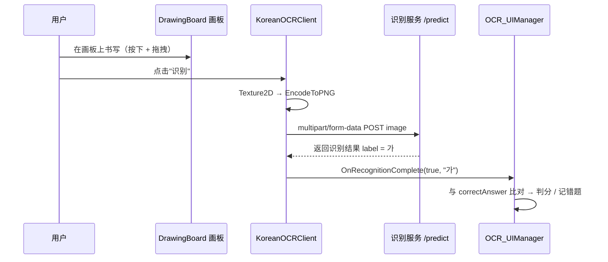

# 手写韩字识别服务

第一章（`Level1-1 ~ Level1-13`）的玩法是「在画板上写韩字 → 识别 → 判分」。识别能力由**一个独立的推理服务**提供，服务本身不在本仓库内，本文说明它的完整链路、客户端配置与自建方式。

## 整体链路

## 客户端组件

| 环节 | 文件 | 要点 |
| --- | --- | --- |
| 画板 | `Assets/AZ/RecFont/RecFontCS/DrawingBoard.cs` | 256×256 `RGB24` 白色画布、`FilterMode.Point`；实现 `IPointerDown` / `IDrag` 等指针接口（可被射线或手势指针驱动），Bresenham 画线 + 圆点笔刷，`OnInitializePotentialDrag` 中关闭拖拽阈值 |
| 识别客户端 | `Assets/AZ/RecFont/RecFontCS/KoreanOCRClient.cs` | 把画板纹理编码为 PNG 后以 `multipart/form-data` POST；解析返回的 `label` / `error`；带超时、取消与协程清理 |
| 判分 UI | `Assets/AZ/Scripts/画画试题/OCR_UIManager.cs` | 识别成功 → `ValidateAnswer(结果, correctAnswer)`；答对显示"下一题"并播放粒子特效，答错触发 `ScreenShake` 后重试 |
| 题目管理 | `Assets/AZ/Scripts/画画试题/OCRQuestionManager.cs` | 题目索引推进、错题收集、答案标准化比较（去空格 + 转小写） |
| 题库结构 | `Assets/AZ/Scripts/画画试题/OCRQuestionData.cs` | `questionText` + `referenceImage` + `questionAudio` + `correctAnswer` |

`KoreanOCRClient` 上的两个可配置项：

| 字段 | 说明 |
| --- | --- |
| `serverURL` | 识别接口地址，格式为 `http://<host>:<port>/predict`。仓库中的默认值指向作者自建的服务，**部署到自己的环境时需要替换**。 |
| `timeoutSeconds` | 请求超时（默认 15 秒）。 |

> 建议把 `serverURL` 从场景 / 预制体的序列化字段中抽出来，改为统一的配置文件或环境变量，避免换环境时逐场景修改。

## 服务端实现

参考实现见 `Assets/AZ/RecFont/server.py`（Flask + TensorFlow SavedModel）：

1. 启动时加载 `saved_model/` 与标签表 `2350-common-hangul.txt`（2350 个常用韩字音节，一行一个标签）；
2. 接口 `POST /predict` 接收表单字段 `image`；
3. 预处理：转灰度 → 缩放到 64×64 → 归一化后反色（白底黑字 → 黑底白字）的一维向量；当书写内容偏离画布中心较多时，改为使用裁剪居中后的版本；
4. 数据增强：旋转（-5° / +5° / +10°）、两档高斯噪声、轻度高斯模糊、三档缩放居中，共 10 个版本；
5. 每个版本单独推理后取**多数投票**作为最终结果，返回 `{"label": "가"}`；
6. 过程写入 `inference_log.txt`，最新结果写入 `result.txt`。

`2350-common-hangul.txt` 存放在 `Assets/AZ/RecFont/`，复制到服务端目录即可使用。`Assets/AZ/RecFont/server.spec` 是打包成单文件可执行程序的 PyInstaller 配置。

### 自建步骤

1. 准备韩字手写识别模型（TensorFlow SavedModel 格式），与 `2350-common-hangul.txt` 一起放在服务端目录；
2. 安装依赖：`flask`、`tensorflow`、`numpy`、`pillow`；
3. 运行 `python server.py` 启动服务（注意按自己的环境修改监听地址与端口）；
4. 确认眼镜或编辑器与服务器网络互通，然后把客户端 `serverURL` 改为该地址；
5. 验证：请求一次 `/predict`，观察服务端 `inference_log.txt` 是否输出「模型加载成功 → 各增强预测 → 最终预测」。

### 调试技巧

- 单点调试可用测试场景 `Assets/AZ/RecFont/RecFontModel.unity`，里面同时挂了画板与识别按钮；
- 日志里的「偏移较大，使用居中图像」说明书写位置偏离中心，识别走的是裁剪居中分支；
- `Assets/AZ/RecFont/temp.jpg`、`Assets/AZ/RecFont/copy.jpg` 是调试期间保存的样张。

## 端侧离线推理（当前不可用）

`Assets/AZ/RecFont/RecFontCS/TensorFlowLiteInfeerence.cs`（类名 `HangulInference`）实现了端侧推理：从 `StreamingAssets/labels.txt` + `model.tflite` 加载模型，预处理与增强投票策略与服务端一致。项目里的 TensorFlow Lite 原生库（`Assets/Plugins/Android` 与内嵌的 `com.github.asus4.tflite` 包）也仍在。

但 `Assets/StreamingAssets/` 目录（含 `model.tflite` 与标签文件）已从仓库中移除，**该路径当前无法运行**。若要恢复离线识别，需要：

1. 把模型转换为 `.tflite` 并放回 `Assets/StreamingAssets/model.tflite`；
2. 把 2350 个标签按行写入 `Assets/StreamingAssets/labels.txt`；
3. 在场景中启用挂有 `HangulInference` 的控制器（`DrawingAndInferenceController`）。

## 遗留方案

`Assets/AZ/RecFont/RecFontCS/PythonServerLauncher.cs`（类名 `PythonScriptRunner`）是早期方案：启动 `StreamingAssets/Fonts/python.exe`，或请求本机 `127.0.0.1:5000/predict`。在移动端不可用，现已不再接入场景，保留作参考。
